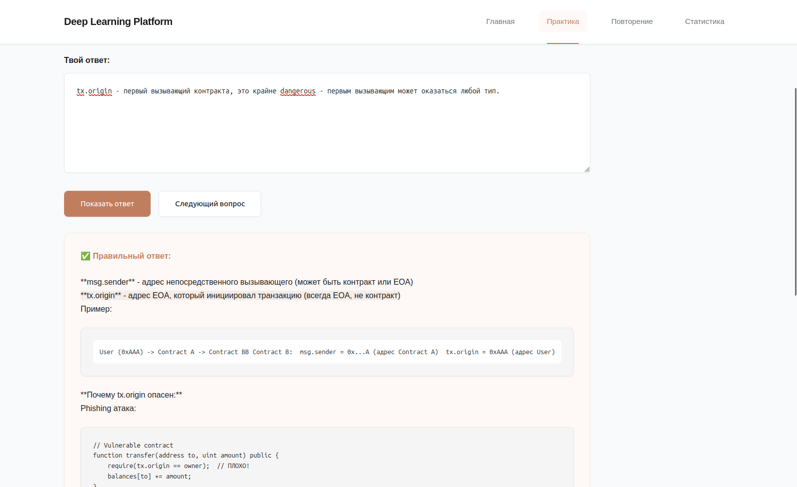

# Interview Practice Platform (made for myself generally)

**easiest way to be better - ask questions**

Локальная веб-платформа для практики технических интервью по blockchain разработке (Solidity, Web3, Python) и другим темам. Платформа помогает систематически изучать концепты через вопросы разной сложности, отслеживать прогресс и улучшать свои знания.



## Возможности

- 📝 Импорт вопросов из Markdown файлов
- 💻 Два режима ответа: текстовый и code editor
- 📊 Отслеживание прогресса и статистики
- 🎯 Сессии практики с автоматическим summary
- 📋 Копирование результатов в блокнот
- 🎨 Минималистичный дизайн в стиле Claude

## Быстрый старт

### 1. Установка зависимостей

```bash
pip install -r requirements.txt
```

### 2. Запуск приложения

```bash
cd backend
python main.py
```

Приложение будет доступно по адресу: http://localhost:8000

### 3. Импорт вопросов

1. Открой http://localhost:8000
2. Загрузи .md файл с вопросами (примеры в папке `questions/`)
3. Начни практику!

## Структура проекта

```
.
├── backend/
│   ├── main.py          # FastAPI приложение
│   ├── database.py      # SQLite модели
│   ├── crud.py          # CRUD операции
│   └── parser.py        # Парсер .md файлов
├── frontend/
│   ├── static/
│   │   ├── style.css    # Стили
│   │   └── app.js       # JavaScript
│   └── templates/
│       ├── index.html   # Главная страница
│       ├── practice.html # Страница практики
│       └── stats.html   # Статистика
├── questions/           # Примеры вопросов
│   ├── solidity-advanced.md
│   └── python-web3-basics.md
└── database.db         # SQLite база (создается автоматически)
```

## Как получить файл с вопросами от нейронки

Простой процесс в 3 шага:

1. **Берешь `FORMAT.md`** - в нем описан формат файлов с вопросами
2. **Отдаешь нейронке** - прикрепляешь `FORMAT.md` и пишешь тему, которую хочешь изучить
   - Например: "Создай файл с вопросами по теме 'Solidity Gas Optimization'"
   - Или: "Сгенерируй вопросы по 'Python Web3 Basics'"
3. **Закидываешь файл** - сохраняешь полученный .md файл и импортируешь в платформу через веб-интерфейс

**Готово!** Теперь можешь начинать практику.

### Формат файлов

Платформа поддерживает два формата:
- **Простой формат** - для обычных независимых вопросов
- **Многоуровневый формат** - для глубокого изучения концептов с прогрессией сложности (Level 1-4)

Подробное описание форматов смотри в `FORMAT.md`.

## API Endpoints

### Импорт вопросов
```
POST /api/import
```
Загрузка .md файла с вопросами

### Работа с темами
```
GET /api/topics
```
Получить список всех тем с количеством вопросов

### Практика
```
GET /api/question/{topic_id}?difficulty=Medium&session_id=1
```
Получить случайный вопрос по теме

```
POST /api/answer
{
  "question_id": 1,
  "user_answer": "...",
  "session_id": 1
}
```
Сохранить ответ пользователя

### Сессии
```
POST /api/session/start
```
Начать новую сессию практики

```
POST /api/session/end
{
  "session_id": 1
}
```
Завершить сессию и получить summary

### Статистика
```
GET /api/stats
```
Получить общую статистику прогресса

```
GET /api/sessions/recent?limit=10
```
Получить последние сессии

## База данных

SQLite с 4 таблицами:

- **topics** - темы вопросов
- **questions** - вопросы с ответами
- **user_answers** - ответы пользователя
- **sessions** - сессии практики

## Использование

### 1. Генерация вопросов

Следуй процессу из секции "Как получить файл с вопросами от нейронки":
- Прикрепи `FORMAT.md` к нейронке
- Укажи тему, которую хочешь изучить
- Получи готовый .md файл с вопросами

### 2. Импорт в платформу

Сохрани полученный файл и загрузи через веб-интерфейс на главной странице (`http://localhost:8000`).

### 3. Практика

1. Выбери тему из списка
2. Читай вопрос
3. Пиши свой ответ (текстом или кодом в редакторе)
4. Нажми "Показать ответ" чтобы проверить себя
5. Переходи к следующему вопросу

### 4. Статистика и прогресс

После завершения сессии:
- Получишь summary для копирования в блокнот
- Посмотри статистику на странице `/stats`
- Отслеживай прогресс по темам и сложности

## Примеры тем

- **Solidity Advanced** - уязвимости, оптимизация gas, паттерны
- **Python Web3** - подключение к nodes, транзакции, events
- **Blockchain Theory** - консенсус, криптография, архитектура
- **FastAPI** - эндпоинты, валидация, async
- **React Hooks** - useState, useEffect, кастомные хуки
- И любые другие темы для твоего роста!

## Технологии

- **Backend**: FastAPI (Python)
- **Database**: SQLite
- **Frontend**: HTML + Tailwind CSS + Alpine.js
- **Code highlighting**: highlight.js

## Лицензия

MIT - doing whatever you want.

